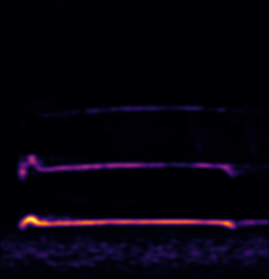
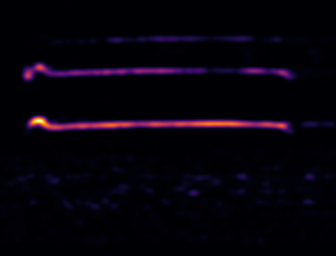
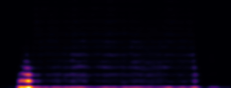
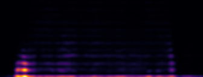
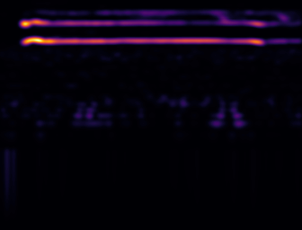
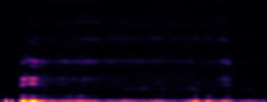
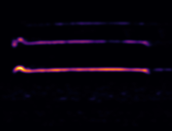
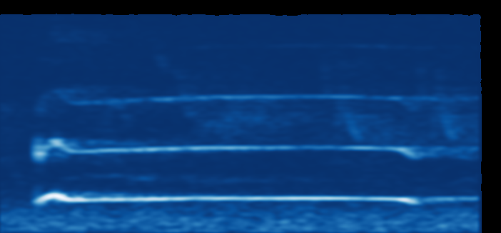
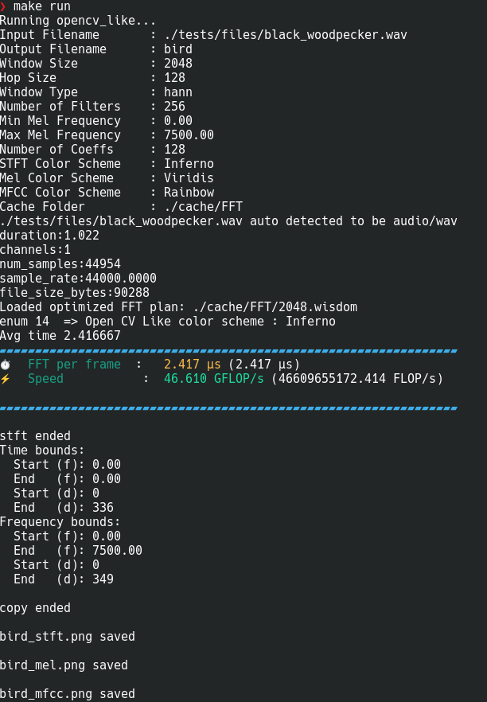

# 🎧 CARA (C Acoustic Representation & Analysis): High-Performance Audio Signal Processing and Visualization Pipeline

**CARA** is a high-performance C library for audio signal processing and visualization, featuring Short-Time Fourier Transform (STFT), Mel spectrograms, Mel-Frequency Cepstral Coefficients (MFCC), and professional-grade heatmap visualizations. Optimized for large-scale audio datasets, it leverages [FFTW](http://www.fftw.org/) with wisdom caching, [OpenMP](https://www.openmp.org/) parallelization, and BLAS ([OpenBLAS](https://www.openblas.net/)) for fast matrix operations. The library supports multiple audio formats (WAV, FLAC, MP3) via [libsndfile](https://libsndfile.github.io/libsndfile/) and [minimp3](https://github.com/lieff/minimp3), and offers customizable visualizations with extensive color schemes.

## ✨ Key Features

- 🎧 **Audio I/O**: Reads WAV, AAC, MP3 etc. with auto-detection. [minimp3](https://github.com/lieff/minimp3) decodes MP3s as fast as minimp3 allows; other formats use [libsndfile](https://libsndfile.github.io/libsndfile/).
- 📊 **Short-Time Fourier Transform (STFT)**: Uses FFTW with wisdom caching to plan FFTs. Still slower than Librosa for unknown reasons. Supports Hann, Hamming, Blackman, and more. Tweak window size, hop size, and frequency bounds freely.
- 🔊 **Mel Spectrogram**: Dynamically builds Mel filter banks. Accelerated with BLAS (`cblas_sdot`) and OpenMP. Has optional dB scaling with branchless computation for speed—though aggressive tuning causes glitches.
- 🧠 **Mel-Frequency Cepstral Coefficients (MFCC)**: Computes MFCCs using precomputed DCT coefficients and BLAS. OpenMP parallelization helps. Not blazing fast, but supports clean heatmap visualizations with custom colormaps.
- 🖼️ **Visualization**: Outputs STFT, Mel spectrograms, and MFCCs as PNG heatmaps using [libheatmap](https://github.com/lucasb-eyer/libheatmap). Supports 🎨 **130 Colormap Variants**:
  - 🎨 22 OpenCV-style colormaps
  - 🌈 108 scientific colormaps (27 base × 4 variants: discrete, soft, mixed, mixed_exp)
- ⏱️ **Benchmarking**: Microsecond-precision profiling for STFT, Mel, MFCC, and visualization. Ranked timing reports with color-coded bars show exactly where time is spent. Outputs JSON and raw data for further analysis.
- ⚙️ **Performance Optimizations**: OpenMP parallelism, FFTW wisdom caching, BLAS matrix ops, and compiler flags (`-ffast-math`, `-march=native`, `-funroll-loops`, LTO). Aligned memory helps—still not Librosa-tier, but close.
- 🐦 **Applications**: Ideal for bioacoustics (e.g., bird calls: `tests/files/black_woodpecker.wav`, `tests/files/173.mp3`), large-scale audio processing, ML feature extraction, and DSP research.

## 💡 Motivation

The main motivation behind this project was to gain a deeper understanding of both **C** and **digital signal processing (DSP)**. While there are countless tutorials on how to **use** MFCCs and Mel filter banks, very few actually explain how to **compute** them from scratch. The process was often fragmented or hidden behind library calls.

When searching for minimalist MFCC pipelines, I came across excellent projects like [rust-mfcc](https://github.com/bytesnake/mfcc), which performed impressively — about **2.5× faster than Librosa** on synthetic benchmarks ([Colab Notebook](https://github.com/8g6-new/mfcc_rust_bench/blob/master/rust_vs_python.ipynb)).  
However, they often rely on external dependencies and abstractions that obscure what's happening under the hood.

I noticed a lack of **simple, dependency-free, well-structured C implementations** of STFT, Mel spectrograms, and MFCCs that emphasize:

1. **Readability** – Code that beginners in C can actually follow  
2. **Educational Value** – A step-by-step DSP pipeline laid bare  
3. **Transparency** – Each transform is explicitly written (FFT, Mel bank, DCT)

As I built this project, I came to understand and appreciate:
- How **windowing**, **hop size**, and **FFT resolution** interact  
- The inner workings of **Mel filter bank construction**  
- How to derive **MFCCs using DCT**, and why the coefficients matter  
- The performance implications of **memory layout**, **cache locality**, and **contiguous memory access**  
- How small details like **loop nesting**, **BLAS vectorization**, and **data alignment** can drastically affect speed

This project isn't **currently** trying to beat Librosa or Rust DSP libraries in performance — **though future optimizations may close the gap**.

Instead, it's meant to be a **clear, hackable, and minimalist reference** for students, hobbyists, and anyone who wants to learn DSP by building it from the ground up.

If it helps others demystify the DSP pipeline or write their own from scratch, then it's done its job.

## Pipeline Overview

```mermaid
%%{init: {
  "theme": "base",
  "themeVariables": {
    "primaryColor": "#1e1e1e",
    "primaryTextColor": "#ffffff",
    "primaryBorderColor": "#ffaa00",
    "clusterBkg": "#2a2a2a",
    "clusterBorder": "#ffaa00",
    "lineColor": "#ffaa00",
    "fontSize": "14px",
    "fontFamily": "monospace"
  }
}}%%

flowchart TD
    A["📥 Audio Input (.wav / .mp3)"] --> B["🔍 Auto File Type Detection"]
    B --> C{"🧩 Format Type"}
    C -->|MP3| D["🎧 Decode with minimp3"]
    C -->|Other| E["🎵 Read with libsndfile"]
    D --> F["🎚️ Normalize → Float32"]
    E --> F

    subgraph Feature Extraction
        F --> G["🪟 Apply Window Function (e.g., hann)"]
        G --> H["⚡ STFT (FFTW + Wisdom)"]
        H --> I["📊 Extract Magnitudes & Phases"]
        I --> J["🎚️ Apply Generalized Filter Bank (BLAS)"]
        J --> K["🎯 Compute FCC (DCT)"]
    end

    subgraph Visualization
        H --> V1["🖼️ STFT Heatmap"]
        J --> V2["🎨 Filter Bank Spectrogram"]
        K --> V3["🌡️ FCC Heatmap"]
    end

    subgraph Benchmarking
        H --> B1["⏱️ Time STFT"]
        J --> B2["⏱️ Time Filter Bank"]
        K --> B3["⏱️ Time FCC"]
        V1 --> B4["⏱️ Time Plot Generation"]
    end
```

## 🛠️ Recent Changes

- **Generalized Filter Banks**: Added `gen_filterbank` in `spectral_features.h` to support Mel, Bark, ERB, Cam, Log10, and Cent scales, optimized with BLAS (`cblas_sdot`) and OpenMP for flexible audio analysis.
- **Single Plot Function**: Consolidated visualization into a single `plot` function in `audio_visualizer.h`, supporting **130+ color schemes** (22 OpenCV-style, 108 scientific variants) for STFT, filter banks, and FCCs.
- **Isolated Filter Application**: Decoupled filter application in `apply_filter_bank` for modularity, enhancing reusability for ML pipelines (e.g., TurboVAD) and maintainability.
- **Performance**: Achieves 1.966 µs per frame (57.296 GFLOP/s) for STFT and 141.614 ms for FCC on a 58-second file.


## Performance Highlights

- **MP3 Decoding & PNG Saving**: fast compred to  Python. minimp3 and libpng just show up, do their job, and leave..

- **STFT & Mel Spectrogram**: Still slower than Librosa — even with FFTW wisdom caching and OpenMP. Not sure why. Librosa somehow still beats it. The Mel spectrogram part was especially disappointing: I tried to make it fast with BLAS, but the output came out wrong. Only one loop could be vectorized — the other two just sat there, immune to optimization. The filter bank creation is clean, but the actual dot-product part still suffers under that cursed 2-level nested loop ( I could eliminate 1 loop via BALS though, kinda win ig).

- **Scalability**: OpenMP does help  not so much , very much usable until you compare the core DSP to librosa

## Requirements

- **Compiler**: GCC or Clang with C11 support.
- **Dependencies**:
  - **FFTW3** ([FFTW](http://www.fftw.org/)) for fast Fourier transforms.
  - **libsndfile** ([libsndfile](https://libsndfile.github.io/libsndfile/)) for WAV/FLAC file handling.
  - **OpenMP** ([OpenMP](https://www.openmp.org/)) for parallel processing.
  - **BLAS** (e.g., [OpenBLAS](https://www.openblas.net/)) for matrix operations.
  - **libpng** ([libpng](http://www.libpng.org/pub/png/libpng.html)) for PNG output.

## Installation

### Step 1: Install Dependencies
For Ubuntu/Debian:
```bash
sudo apt-get update
sudo apt-get install libfftw3-dev libsndfile1-dev libopenblas-dev libpng-dev libomp-dev
```

### Step 2: Clone the Repository
```bash
git clone https://github.com/8g6-new/CARA && cd CARA
```

### Step 3: Build the Project
Choose a build target:
- **Built-in color schemes**:
  ```bash
  make builtin
  ```
- **OpenCV-like color schemes**:
  ```bash
  make opencv_like
  ```


The build creates executables in `build/builtin` or `build/opencv` and generates FFTW wisdom files in `cache/FFT` (e.g., `1024.wisdom`).

## Usage

### Command-Line Interface
Run the `main` program to process an audio file and generate STFT, Mel spectrogram, and MFCC visualizations:
```bash
./build/builtin/main <input_file> <output_prefix> <window_size> <hop_size> <window_type> <num_mel_banks> <min_mel> <max_mel> <num_mfcc_coeffs> <cs_stft> <cs_mel> <cs_mfcc> <cache_folder>
```

**Parameters**:
- `input_file`: Path to audio file (e.g., `tests/files/black_woodpecker.wav`).
- `output_prefix`: Prefix for output PNG files (e.g., `outputs/black_woodpecker`).
- `window_size`: STFT window size (e.g., 2048).
- `hop_size`: Hop size for STFT (e.g., 512).
- `window_type`: Window function (e.g., `hann`, `hamming`, `blackman`).
- `num_mel_banks`: Number of Mel filters (e.g., 40).
- `min_mel`, `max_mel`: Frequency range for Mel filters (e.g., 20.0, 8000.0).
- `num_mfcc_coeffs`: Number of MFCC coefficients (e.g., 13).
- `cs_stft`, `cs_mel`, `cs_mfcc`: Color scheme indices (e.g., 0 for default, see `output/colors.json`).
- `cache_folder`: Directory for FFTW wisdom files (e.g., `cache/FFT`).

**Example**:
```bash
./build/builtin/main tests/files/black_woodpecker.wav outputs/black_woodpecker 2048 512 hann 40 20.0 8000.0 13 0 0 0 cache/FFT
```

**Output**:
- PNG files: `outputs/black_woodpecker_stft.png`, `outputs/black_woodpecker_mel.png`, `outputs/black_woodpecker_mfcc.png`.
- Console output: Audio metadata (duration, sample rate) and ranked benchmark timings.

### Programmatic Usage
Below is a simplified example of using the library in C:

```c
#include <stdio.h>
#include <stdlib.h>
#include <string.h>

#include "headers/audio_tools/audio_visualizer.h"

int main() {
    // --- Step 1: Load Audio ---
    audio_data audio = auto_detect("tests/files/black_woodpecker.wav");

    if (!audio.samples) {
        fprintf(stderr, "Failed to load audio.\n");
        return 1;
    }

    // --- Step 2: Parameters ---
    int window_size = 2048;
    int hop_size = 512;
    const char *window_type = "hann";
    int num_filters = 40;
    float min_freq = 20.0f, max_freq = 8000.0f;
    int num_coff = 13;

    // --- Step 3: Precompute ---
    float *window_values = malloc(window_size * sizeof(float));
    window_function(window_values, window_size, window_type);

    fft_d fft = init_fftw_plan(window_size, "cache/FFT");
    stft_d result = stft(&audio, window_size, hop_size, window_values, &fft);

    float *filterbank = calloc((result.num_frequencies + 1) * (num_filters + 2), sizeof(float));
    filter_bank_t bank = gen_filterbank(F_MEL, min_freq, max_freq, num_filters,
                                        audio.sample_rate, window_size, filterbank);

    dct_t dct = gen_cosine_coeffs(num_filters, num_coff);

    // --- Step 4: Visualization Setup ---
    plot_t settings = {
        .cs_enum = Viridis,  // or enum any other built-in colormap 
        .db = true,
        .output_file = "outputs/stft.png",
        .bg_color = {0, 0, 0, 255}
    };

    bounds2d_t bounds = {0};
    init_bounds(&bounds, &result);
    set_limits(&bounds, result.num_frequencies, result.output_size);

    int t_len = bounds.time.end_d - bounds.time.start_d;
    int f_len = bounds.freq.end_d - bounds.freq.start_d;

    float *cont_mem = malloc(t_len * f_len * sizeof(float));
    fast_copy(cont_mem, result.magnitudes, &bounds, result.num_frequencies);

    // --- Step 5: STFT Plot ---
    settings.h = f_len;
    settings.w = t_len;
    strcpy(settings.output_file, "outputs/stft.png");
    plot(cont_mem, &bounds, &settings);

    // --- Step 6: Mel Filter Bank Spectrogram ---
    float *mel_values = apply_filter_bank(cont_mem, num_filters, result.num_frequencies,
                                          filterbank, &bounds, &settings);

    settings.h = num_filters;
    strcpy(settings.output_file, "outputs/mel.png");
    plot(mel_values, &bounds, &settings);

    // --- Step 7: FCC / MFCC ---
    float *fcc_values = FCC(mel_values, &dct, &bounds, &settings);

    settings.h = num_coff;
    strcpy(settings.output_file, "outputs/mfcc.png");
    plot(fcc_values, &bounds, &settings);

    // --- Step 8: Cleanup ---
    free(window_values);
    free(filterbank);
    free(mel_values);
    free(fcc_values);
    free(cont_mem);
    free_fft_plan(&fft);
    free_stft(&result);
    free_audio(&audio);
    free(dct.coeffs);
    free(bank.freq_indexs);
    free(bank.weights);

    printf("Done. Output saved to outputs/ directory.\n");
    return 0;
}
```


## 📊 Full Function Visualizations

Below are visualizations produced by the pipeline for a single audio input (`black_woodpecker.wav`), using various color schemes and stages of the DSP pipeline: STFT, Mel Spectrogram, and MFCC.

---

### 🎛️ Function Outputs

# 🎧 Filter Bank & FCC Visualizations

Visualizations generated using a **2048-point FFT**, **128-sample hop size**, and the specified color schemes.

| Output Type              | Description                                                | Colormap Used | Preview |
|--------------------------|------------------------------------------------------------|----------------|---------|
| **STFT Spectrogram**     | Raw Short-Time Fourier Transform magnitudes                | Inferno        |  |
| **Mel Filterbank**       | 256-filter Mel-scale spectrogram                           | Viridis        |  |
| **MFCC**                 | 128 Mel-Frequency Cepstral Coefficients                    | Rainbow        |  |
| **Bark Filterbank**      | Bark-scale filter spectrogram                              | Plasma         |  |
| **BFCC**                 | Bark-scale Frequency Cepstral Coefficients                 | Rainbow        |  |
| **ERB Filterbank**       | Equivalent Rectangular Bandwidth filter spectrogram        | Magma          |  |
| **ERB-FCC**              | ERB-based Frequency Cepstral Coefficients                  | Rainbow        |  |
| **CHIRP Filterbank**     | Chirp-scale filter spectrogram                             | Cividis        |  |
| **CHIRP-FCC**            | Chirp-scale Frequency Cepstral Coefficients                | Rainbow        |  |
| **Cambridge ERB-Rate**   | Cochlear-inspired ERB-rate (Glasberg-Moore) visualization  | Turbo          |  |

---


> **Input Settings**
> **Window Size**: 2048  
> **Hop Size**: 128  
> **Window Type**: `hann`  
> **Number of Filters**: 256  
> **Min Frequency**: 0.00 Hz  
> **Max Frequency**: 7500.00 Hz  
> **Number of Coefficients**: 128


### 🐢 STFT Spectrograms (Built-in Color Schemes)

| Colormap        | Style      | Preview |
|------------------|------------|---------|
| **Blues**        | Soft       |  |
| **Spectral**     | Discrete   |  |

---

### 🎨 STFT Spectrograms (OpenCV-like Color Schemes)
 *Colormaps generated via custom script using OpenCV reference gradients:*  
[`ref/opencv_like/colormap_gen.py`](https://github.com/8g6-new/CARA/blob/main/ref/opencv_like/colormap_gen.py)

| Colormap        | Description                                       | Preview |
|------------------|---------------------------------------------------|---------|
| **Rainbow**      | A bright and cheerful spectrum of colors. |  |
| **Jet**          | High-contrast legacy colormap                    |  |


To explore all available color schemes (e.g., Blues, Viridis, Jet, Inferno in discrete, mixed, mixed_exp, and soft variants), refer to the `README.MD` files in:
- [`outputs/colorschemes/libheatmap_defaults/README.MD`](./outputs/colorschemes/libheatmap_defaults/README.MD) for built-in color schemes.
- [`outputs/colorschemes/opencv_like/README.MD`](./outputs/colorschemes/opencv_like/README.MD) for OpenCV-like color schemes.

These files include comprehensive galleries of all color schemes applied to `black_woodpecker.wav`.

## 🎨 Colormap Enum Reference
All supported colormaps are listed in the file:

```bash
output/colors.json
```
This file maps human-readable names to internal enum IDs for both:

OpenCV-like colormaps (e.g., JET, VIRIDIS, HOT)

Built-in scientific colormaps (e.g., Blues.soft, Spectral.mixed_exp)

Refer [`outputs/README.MD`](./outputs/README.MD)


## Output Directory Structure
The `outputs` directory contains:
- `colorschemes/libheatmap_defaults`:
  - `discrete`: High-contrast colormaps (e.g., `black_woodpecker_stft_Blues_discrete.png`).
  - `mixed`: Smooth color transitions (e.g., `black_woodpecker_stft_Blues_mixed.png`).
  - `mixed_exp`: Exponentially scaled colors (e.g., `black_woodpecker_stft_Blues_mixed_exp.png`).
  - `soft`: Softened gradients (e.g., `black_woodpecker_stft_Blues_soft.png`).
- `colorschemes/opencv_like/images`: OpenCV-inspired colormaps (e.g., `black_woodpecker_stft_Viridis.png`).
- `functions`: Mel spectrograms and MFCC heatmaps (e.g., `black_woodpecker_mel.png`, `black_woodpecker_mfcc.png`).

## Benchmarking Output
The `print_bench_ranked` function generates a ranked table of execution times:
- Columns: Function name, execution time (µs, ms, or s), percentage of total runtime.
- Visual: Color-coded bars for quick bottleneck identification.

**Example**:

### 🔍 Sample Benchmark Output

For this input 

```bash
./opencv_like "./tests/files/black_woodpecker.wav" bird 2048 128 hann 256 0 7500 128 16 16 16 "./cache/FFT" 
```

or use can simply use after building either opencv_like (Color 16 will be [Cividis](outputs/functions/stft.png)) or builtin (Color 16 will be [`BuPu - discrete`](outputs/colorschemes/libheatmap_defaults/discrete/black_woodpecker_stft_BuPu_discrete.png))

```bash
make run 
```

This will be the ouput with bechmarks 




Mel looks significantly slower because it calls additional weighted points from the libheatmap lib, which adds delay, doing 2 separate loops was found to be even slower
> **Note** : bechmarked in AMD Ryzen 5 4600H CPU


## Project Structure

```
.
├── cache/FFT/              # FFTW wisdom files for optimized FFT plans
├── headers/                # Header files for audio tools, heatmap, and utilities
├── outputs/                # Generated spectrograms, Mel spectrograms, and MFCC heatmaps
├── src/                    # Source code for audio processing, visualization, and utilities
│   ├── libheatmap/         # Heatmap visualization code
│   ├── png_tools/          # PNG output utilities
│   ├── utils/              # Benchmarking and utility functions
│   ├── audio_tools/        # Audio I/O, STFT, Mel, and MFCC computation
├── tests/files/            # Test audio files (e.g., black_woodpecker.wav, bird.mp3)
├── main.c                  # Main program for testing the pipeline
├── Makefile                # Build configuration
└── README.md               # This file
```

## Performance Optimization Tips

- **BLAS**: Use optimized BLAS (e.g., [OpenBLAS](https://www.openblas.net/)) for faster Mel and MFCC computations.
- **Wisdom Caching**: Pre-generate FFTW wisdom files for common window sizes.
- **Matrix Operations**: Replace `cblas_sdot` with `cblas_sgemm` for batched matrix multiplications in `mel_spectrogram` and `mfcc`.
- **Fast Math**: Test `-ffast-math` for numerical stability, as it may introduce inaccuracies.
- **GPU**: Pipeline is GPU-ready for STFT ([cuFFT](https://developer.nvidia.com/cufft)), Mel spectrograms ([cuBLAS](https://developer.nvidia.com/cublas)), and visualization (CUDA kernels).

## Future Work

- **Explicit SIMD Support**: Implement explicit SIMD optimizations (e.g., SSE, SSE2, AVX, AVX2) for STFT, Mel spectrogram, and MFCC computations, beyond current implicit support via `minimp3` and compiler flags.
- **GPU Acceleration**: Implement CUDA-based STFT ([cuFFT](https://developer.nvidia.com/cufft)), Mel spectrograms ([cuBLAS](https://developer.nvidia.com/cublas)), and visualization for Librosa-like performance.
- **Sparse Matrix Operations**: Use CSR format for Mel filter banks to reduce memory and computation.
- **Real-Time Processing**: Support streaming audio analysis.
- **Enhanced Benchmarking**: Add memory usage and CPU/GPU utilization metrics to `bench.h`.
- **Simple Heatmap**: Replace `heatmap_add_weighted_point()` in `libheatmap` with a custom heatmap generator for faster rendering.
- **Memory Pooling**: Implement memory pooling using a memory arena to improve utilization and prevent issues like use-after-free.
- **Advanced Memory Management**: Integrate buddy allocators or other techniques to optimize memory allocation and reduce fragmentation.
- **Documentation**: Add detailed API docs and usage examples to `headers/` and `README.md`.

## 📄 License

- **Code**: Licensed under the [MIT License](./LICENSE).  
  You are free to use, modify, and distribute the code, including for commercial purposes, with proper attribution.

Credit this work if used in research or applications.

## Acknowledgments

- Inspired by [Librosa](https://librosa.org/) for high-performance audio processing in C.
- Tested on bioacoustics datasets (e.g., bird calls), with thanks to [FFTW](http://www.fftw.org/) and [libsndfile](https://libsndfile.github.io/libsndfile/).
- Gratitude to [OpenBLAS](https://www.openblas.net/), [libpng](http://www.libpng.org/pub/png/libpng.html), and [OpenMP](https://www.openmp.org/).
- Thanks to [lucasb-eyer/libheatmap](https://github.com/lucasb-eyer/libheatmap) for the heatmap visualization module.
- Credit to [lieff/minimp3](https://github.com/lieff/minimp3) for lightweight MP3 decoding.
